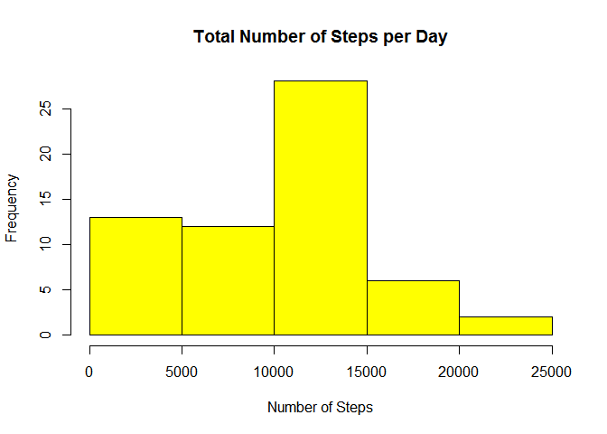
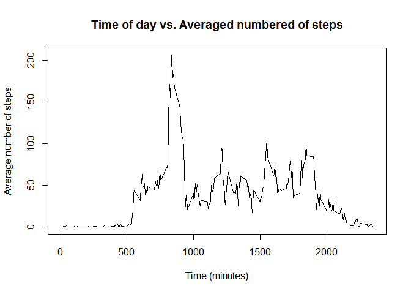
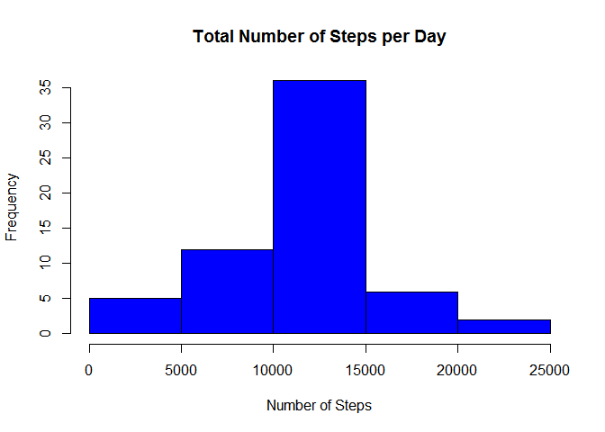

# Reproducible Research: Peer Assessment 1


## Loading and preprocessing the data


```r
setwd("C:/Users/usuario/Desktop/DataScience")
data <- read.csv("activity.csv")
data$date <- as.Date(data$date)
data$interval <- as.factor(data$interval)
```


## What is mean total number of steps taken per day?


```r
totalnumberofsteps <- tapply(data$steps,data$date,FUN=sum, na.rm=TRUE)
hist(totalnumberofsteps, main= "Total Number of Steps per Day", 
     xlab = "Number of Steps", col="yellow")
```

 


```r
meansteps <- mean(totalnumberofsteps)
mediansteps <- median(totalnumberofsteps)
```

The mean of the number of steps per day is 9354.2295082 and the median is 10395

## What is the average daily activity pattern?


```r
averagenumberofsteps <- tapply(data$steps,data$interval,FUN = mean, na.rm = TRUE)
plot(levels(data$interval),averagenumberofsteps, type = "l", main = "Time of day vs. Averaged numbered of steps", xlab="Time (minutes)", ylab=  "Average number of steps")
```

 


```r
searchmax <- averagenumberofsteps == max(averagenumberofsteps)
answer <- levels(data$interval)[searchmax]
answer <- as.numeric(answer)
intervalmax <- (answer-5)
```

The 5 minute interval that contains the maximum number of steps, in average across all the days in the data set is: 830 - 835 interval. 

## Imputing missing values

```r
x <- complete.cases(data$steps)
datarowscomplete <- table(x)
numberofNAs <- as.numeric(datarowscomplete[1])
```

The total number of rows with NAs is 2304. 

NA values will be filled with the mean for that 5 minute interval. 


```r
data1 <- data
for (i in 1:nrow(data)){
  if ( x[i] == FALSE ){
    level <- data[i,"interval"]
    get <- data$interval == level
    getting <- data[get, "steps"] 
    data1[i,"steps"] <- mean(getting, na.rm = TRUE)
  }
}
```

The new histogram would be: 


```r
totalnumberofsteps1 <- tapply(data1$steps,data1$date,FUN=sum)
hist(totalnumberofsteps1, main= "Total Number of Steps per Day", 
     xlab = "Number of Steps", col="blue")
```

 

## Are there differences in activity patterns between weekdays and weekends?

```r
NewCol <- matrix(nrow = nrow(data1))
for (i in 1:nrow(data1)){
  if (weekdays(data1[i,2]) == "sabado"){
    data1[i,4] <- "weekend"
  }else{
      if (weekdays(data1[i,2]) == "domingo"){
    data1[i,4] <- "weekend"
      }else{
      data1[i,4] <- "weekday"
      }
  }
}
NewCol <- data.frame(NewCol)
cbind(data1,NewCol)
```

